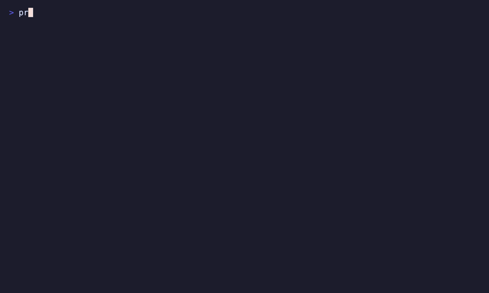

# Portable Analytics Stack

This project is a Bruin-first portable lakehouse for NYC crash analytics. It ingests the public NYC Open Data Motor Vehicle Collisions dataset, stores table data in DuckLake on Cloudflare R2, uses Neon Postgres as the DuckLake catalog, and builds a small set of Bruin transformation assets on top.



## What It Builds

- `nyc_open_data.motor_vehicle_collisions`: raw Socrata ingest for dataset `h9gi-nx95`.
- `lakehouse.base_model`: typed and deduplicated DuckDB view over the raw table.
- `lakehouse.incremental_model`: collision fact table refreshed with a configurable lookback window.
- `lakehouse.full_model`: aggregate table by crash date, ZIP code, contributing factor, and vehicle type.
- `lakehouse.full_model_polars`: optional disabled Polars parity asset.

The Bruin project lives in `pipeline/`:

```text
pipeline/
  pipeline.yml
  assets/
    nyc_open_data/
    lakehouse/
```

Root-level files hold developer tooling: `pyproject.toml`, `uv.lock`, `.env.example`, GitHub Actions workflows, and the generated VHS demo.

## How It Works

Bruin orchestrates both ingestion and transformation:

1. The `ingestr` asset reads NYC Open Data's Motor Vehicle Collisions endpoint through Socrata.
2. Bruin writes the raw data into DuckLake using the `ducklake` DuckDB connection.
3. DuckLake stores data files in Cloudflare R2 and catalog metadata in Neon Postgres.
4. SQL assets build a typed base view, an incremental fact table, and an aggregate table.
5. Built-in and custom checks validate row presence, primary keys, and aggregate grain.

The pipeline starts at `2012-07-01`, matching the historical coverage of the NYC dataset. Daily runs refresh the requested date window plus the configured `incremental_lookback_days` value from `pipeline/pipeline.yml`.

## Prerequisites

- Bruin CLI `v0.11.660+`
- Python `3.12+`
- `uv`
- Cloudflare R2 bucket plus S3 API credentials
- Neon Postgres database for the DuckLake catalog
- Socrata app token for NYC Open Data

Install Bruin:

```bash
curl -LsSf https://getbruin.com/install/cli | sh
```

Install Python dependencies:

```bash
uv sync
```

## Configuration

Copy the example env file and fill in your local values:

```bash
cp .env.example .env
```

Required values:

- `POSTGRES_HOST`
- `POSTGRES_PORT`
- `POSTGRES_DB`
- `POSTGRES_USER`
- `POSTGRES_PASSWORD`
- `DUCKLAKE_DATA_PATH`
- `AWS_ACCESS_KEY_ID`
- `AWS_SECRET_ACCESS_KEY`
- `AWS_REGION`
- `R2_S3_ENDPOINT`
- `SOCRATA_APP_TOKEN`

Use a dedicated Neon database and R2 prefix for this project so DuckLake metadata and data files stay isolated from other experiments.

The local `.env`, `.bruin.yml`, `.bruin/`, and generated logs are gitignored. GitHub Actions generate `.bruin.yml` from repository secrets at runtime.

## Run Locally

Check Bruin connections:

```bash
set -a
. ./.env
set +a
bruin connections list
```

Validate the pipeline:

```bash
set -a
. ./.env
set +a
bruin validate pipeline --environment production --force
```

Run the initial full-refresh bootstrap:

```bash
set -a
. ./.env
set +a
bruin run pipeline --full-refresh --start-date 2012-07-01 --end-date "$(date -v-1d +%F)" --environment production --force
```

Run the normal daily pipeline:

```bash
set -a
. ./.env
set +a
bruin run pipeline --environment production --force
```

Query DuckLake through Bruin:

```bash
set -a
. ./.env
set +a
bruin query -c ducklake -q "select count(*) from nyc_open_data.motor_vehicle_collisions" --environment production
bruin query -c ducklake -q "select * from lakehouse.full_model limit 10" --environment production
```

Run only Bruin checks:

```bash
set -a
. ./.env
set +a
bruin run pipeline --only checks --environment production --force
```

## GitHub Actions

Push required secrets from your local `.env`:

```bash
ENV_FILE=./.env ./set_github_actions_secrets_from_env.sh
```

Workflows:

- `.github/workflows/bruin_pr.yaml`: validates the Bruin pipeline on pull requests.
- `.github/workflows/daily_pipeline.yaml`: validates and runs the production pipeline daily at 00:00 UTC and on manual dispatch.

## Demo

The terminal demo is generated with Charm's VHS:

```bash
vhs demos/portable-analytics-stack.tape
```

The checked-in GIF is `demos/portable-analytics-stack.gif`.
